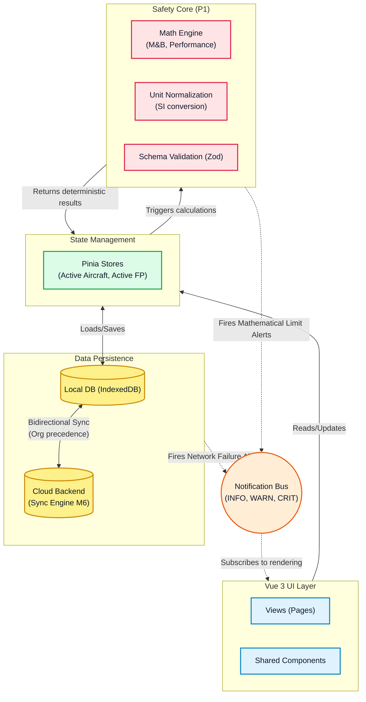
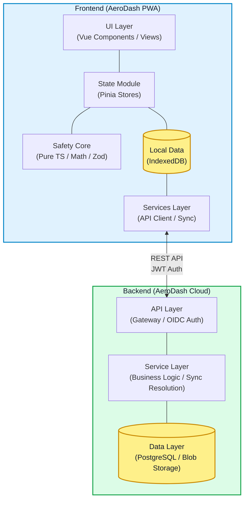

# AeroDash Architecture Overview

## Motivation and Core Constraints

AeroDash is a safety-critical flight preparation advisory tool for General Aviation pilots. The architecture is driven by the following constraints:

- **Offline-First Applicability**: Must function globally on remote airfields devoid of cellular connectivity.
- **Computational Safety**: Mathematical operations must be traceable, deterministically testable, and robust against misinterpretation.
- **Platform Agnosticism**: General Aviation cockpits are BYOD (Bring Your Own Device). It must work performantly on old iPads, Android devices, and modern Desktop browsers.
- **Data Portability**: Aircraft definitions must be strictly versioned, exportable (JSON), and cleanly separable from the core calculation logic over long lifecycles.

## High-Level Architecture

AeroDash is an **Offline-first Progressive Web Application (PWA)** built on Vue 3.

The architecture emphasizes strict decoupling of the safety-critical computational mathematical core (P1 logic) from the Reactive UI layers.

### Data Flow & Component Interaction



### System Context & Component Architecture

The following diagram illustrates the structural boundaries between the local AeroDash client and the remote cloud infrastructure. It highlights the modular layer design within both environments and their interaction via the REST API.



## Architectural Layers

- **Safety Core (`core/`)**: Framework-agnostic, pure TypeScript implementation handling all calculations, physical unit normalization (kg, m, L, s), and structural Zod schema validation.
- **State & State-Management (`stores/`)**: Leverages `Pinia` (Type-safe Vue state) to maintain the ephemeral state of the active Flight Plan and the selected Aircraft Profile.
- **Data Persistence (`services/`)**: Local browser storage (`IndexedDB`) is the primary source of truth. Synchronizes bidirectionally with an OIDC-authenticated cloud backend.
- **Communication & Notification Bus**: Decoupled rules engine. Generates explicitly structured notifications (INFO, WARNING, CRITICAL) when mathematical limits are approached or API requests drop.
- **UI & Presentation (`views/`, `components/`)**: Built with Vue 3 SFCs (no JSX). `vite-plugin-pwa` registers Service Workers caching the App Shell and computation logic for true 0-byte initial rural visits.

## Directory Structure Matrix

```text
aerodash/
├── src/
│   ├── core/         # Pure TS (P1 Logic): Math engine, validators, unit normalization.
│   ├── stores/       # Pinia State Management: Ephemeral UI state (Active Aircraft/Flight).
│   ├── components/   # Vue 3 SFCs: Reusable, reactive UI elements (No business logic).
│   ├── views/        # Vue 3 Router Views: High-level page compositions.
│   └── services/     # API/Integrations: IndexedDB wrapper, Cloud Sync, Notification Bus.
└── tests/
    ├── unit/         # Vitest: Deterministic testing covering the `core/` math & boundaries.
    └── e2e/          # Playwright: End-to-end verification of Critical User Journeys.
```

## Technology Stack Summary

- **Frontend Framework**: Vue 3 (Composition API, No JSX) + Strict TypeScript
- **Tooling**: Vite, vue-tsc, Pinia, Vue Router
- **Formatting/Quality**: ESLint, Oxlint, Prettier
- **Testing**: Vitest (Unit/Logic/Core), Playwright (E2E/UI Flows)
- **Traceability/Safety**: `shtracer` (Requirements-to-Code mapping)

## Detailed Architecture

The detailed architecture (Design Details, Data Models, Schemas, etc.) and architecture decisions ADR are documented in the [docs/architecture](docs/architecture) folder.
