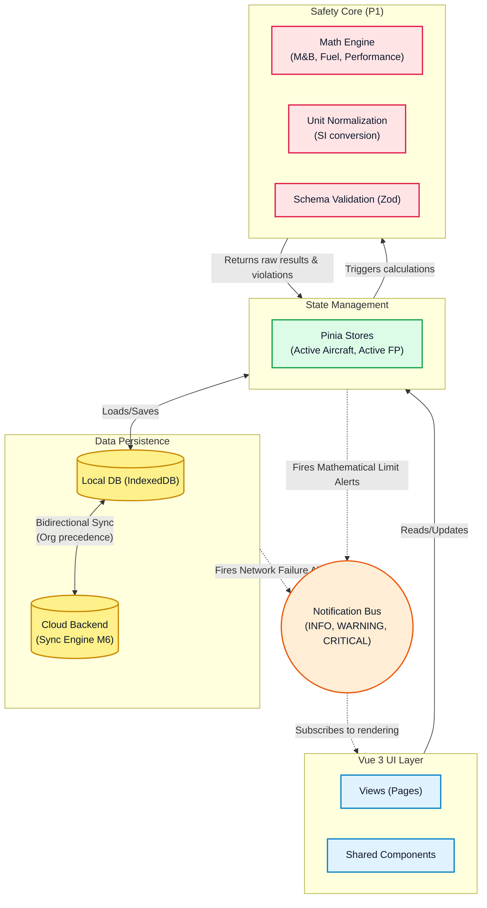
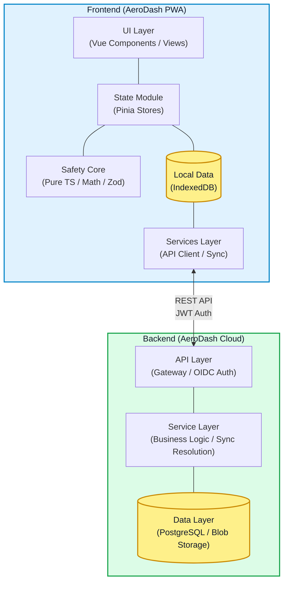

# AeroDash Architecture Overview

## Motivation and Core Constraints

AeroDash is a safety-critical flight preparation advisory tool for General Aviation pilots. The architecture is driven by the following constraints:

- **Offline-First Applicability**: Must function globally on remote airfields devoid of cellular connectivity.
- **Computational Safety**: Mathematical operations must be traceable, deterministically testable, and robust against misinterpretation.
- **Platform Agnosticism**: General Aviation cockpits are BYOD (Bring Your Own Device). It must work performantly on old iPads, Android devices, and modern Desktop browsers.
- **Data Portability**: Aircraft definitions must be strictly versioned, exportable (JSON), and cleanly separable from the core calculation logic over long lifecycles.

## High-Level Architecture

AeroDash is an **Offline-first Progressive Web Application (PWA)** built on Vue 3.

The architecture emphasizes strict decoupling of the safety-critical computational mathematical core (P1 logic) from the Reactive UI layers.

### Data Flow & Component Interaction



### System Context & Component Architecture

The following diagram illustrates the structural boundaries between the local AeroDash client and the remote cloud infrastructure. It highlights the modular layer design within both environments and their interaction via the REST API.



## Architectural Layers

- **Safety Core (`core/`)**: Framework-agnostic, pure TypeScript implementation handling all calculations, physical unit normalization (kg, m, L, s), and structural Zod schema validation. This is the P1 boundary — zero Vue/framework dependencies, enforceable via linting rules.
- **Feature Modules (`modules/`)**: Encapsulated domain modules (M&B, Performance, Weather, etc.). Each module owns its components, stores, views, and services. Modules call into `core/` for safety calculations but never contain P1 math directly.
- **Shared App Shell (`shared/`)**: Base UI components, layouts, composition functions, and non-safety utility helpers shared across all modules.
- **Cross-Cutting Plugins (`plugins/`)**: Services with lifecycle or event subscriptions that cut across modules: Notification Bus, Connectivity State detection.
- **Global State (`stores/`)**: Application-level Pinia stores (e.g., active aircraft, active flight plan) shared across modules.
- **Data Persistence (`services/`)**: Module-level or shared external I/O (IndexedDB wrapper, API client, Cloud Sync).
- **UI & Presentation**: Built with Vue 3 SFCs (no JSX). `vite-plugin-pwa` registers Service Workers caching the App Shell and computation logic for true 0-byte initial rural visits.

## Directory Structure Matrix

```text
aerodash/
├── backend/
│   └── ...
└── frontend/                  # Web App Workspace
    ├── src/
    │   ├── core/                    # P1 Safety Core: Pure TS. Zero framework dependencies.
    │   │   ├── domain/              #   Data models (e.g. Envelope, Load Stations, etc.)
    │   │   ├── logic/               #   Math calculations (e.g. Interpolation, polygon checks, M&B, FE, performance).
    │   │   └── adapters/            #   Adapters for external systems (e.g. Zod schema validation for aircraft data).
    │   │
    │   ├── modules/                 # Feature Modules: Encapsulated domain logic.
    │   │   ├── mass-balance/        #   M&B: components/, composables/, stores/, views/
    │   │   │   ├── components/      #      Module specific Vue SFCs
    │   │   │   ├── composables/     #      Module specific Vue composables
    │   │   │   ├── stores/          #      Module specific Pinia stores
    │   │   │   ├── services/        #      Module specific I/O services
    │   │   │   └── views/           #      Module specific Vue views
    │   │   ├── performance/         #   Performance calculation module.
    │   │   ├── fuel-endurance/      #   Fuel & Endurance module.
    │   │   ├── weather/             #   Weather & Meteorological module.
    │   │   ├── aircraft/            #   Aircraft Management module.
    │   │   ├── airport/             #   Airport Database module.
    │   │   ├── sync/                #   Cloud Sync module.
    │   │   └── export/              #   Documentation & Export module.
    │   │
    │   ├── shared/                  # App Shell: Shared UI, layouts, utilities.
    │   │   ├── components/          #   Base Vue SFCs (BaseButton, BaseCard, etc.).
    │   │   ├── composables/         #   Shared Vue composition functions.
    │   │   ├── layouts/             #   Layout components (DefaultLayout, DarkLayout).
    │   │   └── utils/               #   Non-safety TS helpers (formatting, dates).
    │   │
    │   ├── plugins/                 # Cross-cutting Services: Notification Bus, Connectivity.
    │   ├── stores/                  # Global Pinia Stores: App-level state.
    │   ├── router/                  # Vue Router configuration.
    │   └── assets/                  # Static assets (images, fonts, styles).
    │
    └── tests/
        ├── unit/                    # Vitest: Deterministic testing of core/ math & boundaries.
        └── e2e/                     # Playwright: End-to-end verification of Critical User Journeys.
```

## Technology Stack Summary

- **Frontend Framework**: Vue 3 (Composition API, No JSX) + Strict TypeScript
- **Tooling**: Vite, vue-tsc, Pinia, Vue Router
- **Formatting/Quality**: ESLint, Oxlint, Prettier
- **Testing**: Vitest (Unit/Logic/Core), Playwright (E2E/UI Flows)
- **Traceability/Safety**: `shtracer` (Requirements-to-Code mapping)

## Detailed Architecture

The detailed architecture (Design Details, Data Models, Schemas, etc.) and architecture decisions ADR are documented in the [docs/architecture](docs/architecture) folder.
