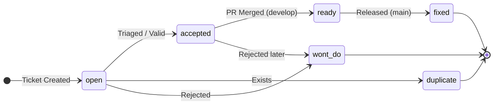

# Contributing to AeroDash

Thank you for your interest in contributing to AeroDash!

As a General Aviation flight-preparation tool, our highest priority is **Safety-First**. We value correctness over speed. A single unverified change in a "Mass & Balance" algorithm could lead to incorrect takeoff data. Therefore, we enforce strict rules to prevent architectural drift, ensure code integrity, and maintain complete traceability.

## 🌟 Welcome & Quick Start

First of all: **Don't panic!** The rules below might look strict, but they are here to guide you, not to scare you away. We love new contributors and are always happy to help you navigate your first Pull Request. 

If you are new here, the best way to get started is:
1.  **Read the Code of Conduct:** All participation is governed by our [Bilingual Code of Conduct / Verhaltenskodex (Just Culture)](CODE_OF_CONDUCT.md). Please read it first!
2.  **Find a "good first issue":** Check the GitHub Project Board for specific `Task` or `Bug` tickets.
3.  **Ask Questions:** If you're unsure about the architecture, where to put a file, or how to write an ADR—just ask in the issue or draft PR! Our senior developers will gladly mentor you.
4.  **Draft Early:** You don't have to be perfect from the start. Open a Draft PR early, run the local checks, and we will review and guide you to the finish line.

The rest of this document outlines the formal "Safety-First" rules we follow to keep our flight-preparation tool reliable.

## 📋 Before You Start

*   **Read the Requirements:** [docs/requirements/README.md](docs/requirements/README.md)
*   **Understand the Branching Strategy:** [docs/development/BRANCHING_STRATEGY.md](docs/development/BRANCHING_STRATEGY.md)
*   **Review the Testing Guidelines:** [docs/development/TESTING.md](docs/development/TESTING.md)

## 💻 Environment Setup (Work in Progress)

Since AeroDash is currently in the pre-alpha phase and our specific tech stack is not finalized, this section acts as a placeholder. Once decisions are made, this will contain:
*   **Tech Stack:** [TBD]
*   **Dependencies:** [TBD - e.g. Node, Python version]
*   **Package Manager:** [TBD]
*   **Local Server / Build Command:** [TBD]
*   **IDE/Editor Recommendations:** [TBD]

## 1. 🛡️ Safety-First Philosophy

*   **Proof of Correctness:** Every PR affecting the Safety Core (P1) must mathematically or logically prove its correctness.
*   **Traceability:** If you write code, we must know *why*. Code changes must trace back to a specific requirement, issue, or Architectural Decision Record (ADR).
*   **Isolation:** Code dealing with UI elements (P3) or external weather API calls (P2) must NEVER contaminate the core flight safety calculations (P1).

## 2. 🔀 Branching Strategy

We strictly adhere to the Gitflow model.
*   **Never commit directly to `main` or `develop`.**
*   Use `feature/...` branches for new code and bug fixes.
*   Always open a **Pull Request** targeting the `develop` branch.
*   For complete details on our branching model, naming conventions, and protection rules, read our **[Branching Strategy Guide](docs/development/BRANCHING_STRATEGY.md)**.

## 3. 📝 Commit Standards

We enforce **Conventional Commits** (`type(scope): description`) for all changes.
For traceability, you must reference the requirement or issue ID if applicable.

**Allowed Types:**
*   `feat`: A new feature
*   `fix`: A bug fix
*   `docs`: Documentation only changes
*   `style`: Code style/formatting (no logic change)
*   `refactor`: Code change that neither fixes a bug nor adds a feature
*   `test`: Adding missing tests or correcting existing tests
*   `chore`: Changes to the build process or auxiliary tools

**AeroDash Specific Scopes:**
The following are the allowed scopes for commits, derived from the project modules. For the complete list of valid scopes and requirements, refer to the **[Requirements Documentation](docs/requirements/README.md)**.
*   `ac`: Aircraft Management
*   `ap`: Airport Database
*   `ad`: Detailed Aircraft Data
*   `fe`: Fuel & Endurance
*   `mb`: Mass & Balance
*   `pf`: Performance
*   `wx`: Weather & Meteorological Data
*   `ui`: User Interface
*   `uq`: Usability & Quality
*   `sys`: General System Requirements
*   `doc`: Documentation & Export
*   `sc`: Cloud Sync & Collaboration
*   `repo`: Repository Management, CI/CD, & Meta Tooling

*Example of a valid commit:*
`feat(mb): implement lateral CG calculation bounds (refs #42, REQ-MB-005)`

## 4. ✅ Quality Gates

We use a multi-layered approach to catch issues as early as possible.

### Local (Pre-commit / Pre-push)

Before you can push your branch, your code must pass local quality gates. You should set up your environment to run these automatically.
*   **Linting & Typing:** We use [TBD - Tech Stack Dependent Tools] to catch type errors and enforce our P1 isolation architecture (e.g., ensuring P1 modules don't import P3 modules).
*   **Formatting:** All code must be strictly formatted according to project standards.

### CI (Automated Suites)

When you open a PR, GitHub Actions will run comprehensive checks.
*   **Automated Tests:** All unit and integration tests must pass.
*   **Dependency Isolation:** The CI strictly verifies that architectural boundaries are maintained.

### Release (Merge-to-Main)

Merging code to the production `main` branch is highly restricted.
*   **No Failing Tests:** Zero tolerance for failing tests or bypassed checks.
*   **Mandatory Peer Review:** All code must be reviewed and approved by at least one other developer. Code modifying P1 logic requires approval from a Lead Developer.

## 5. 🧪 Testing Standards

Comprehensive testing is required for all code changes. For detailed information on our testing practices, expectations, and test suite organization, please refer to our **[Testing Standards](docs/testing/TESTING.md)**.

## 6. 📖 Pull Request Standards

A "Good PR" is small, focused, and easy to review. 
*   **Review your own code first!**
*   You **must** use our `.github/pull_request_template.md` and check all applicable boxes, specifically the Safety Considerations and Traceability sections.
*   If your changes affect Requirements, Architecture, or Risk Mitigation, you must update the corresponding `docs/` files in the same PR.

## 7. 🏗️ P1 Constraints (The Safety Core)

The components residing in the Safety Core (P1) are governed by stricter rules:
*   **Detailed Reviews:** Changes here will undergo extreme scrutiny.
*   **ADR Requirement:** If you are changing the fundamental way a P1 module operates, or altering the developer workflow, you **must** draft a new Architectural Decision Record (ADR) or update an existing one. See our **[Documentation as Code / ADR Guide](docs/architecture/adr/README.md)** for instructions on how to write an ADR.
*   **No "Quick Hacks":** Workarounds are not acceptable in P1. If a library doesn't behave, fix the library or find a different, verifiable approach.

## 8. 🐛 Issue Creation (Bugs & Features)

Non-code contributions are highly valued! If you find a bug or have an idea, please open an issue using one of our templates (`.github/ISSUE_TEMPLATE/`).

*   **Be Thorough:** In aviation software, details matter. Provide complete reproduction steps for bugs, or detailed problem statements and context for new features.
*   **Safety Impact:** Both bug and feature templates ask about "Potential Safety Impact." Please consider this carefully. Could your bug lead to an incorrect data display? Could the new feature confuse a pilot?
*   **Definition of Done:** For feature requests, providing a clear "Checklist" or "Definition of Done" allows developers to understand exactly when the feature is considered complete and safe to merge.

## 9. 🗂️ Project Board & Ticket System

We use the GitHub Project Board (`AeroDash Backlog`) to track all tasks and ensure transparent status management. For the formal architectural decision defining these rules, consult the **[Ticket Workflow ADR](docs/architecture/adr/303-DEV-ticket-workflow.md)**.

### Issue Types

*   **`Bug`**: A flaw, error, or failure in the system.
*   **`Feature`**: A request for new functionality or enhancements. Note that this is **not limited strictly to runtime product features!** It also applies to enhancements in project infrastructure, such as adding Documentation as Code (`docs`), defining new Requirements, or creating Contributing Guidelines.
*   **`Task`**: A specific sub-task belonging to a parent `Feature` or `Bug`.

### Safety Tags

*   **`safety-critical`**: Flags an issue that directly impacts the P1 Safety Core, requiring extreme scrutiny and ADR tracebility.

### Workflow Statuses & Lifecycle

*   **`open`**: Ticket created. This is the initial default status of any new ticket.
*   **`accepted`**: The ticket is reviewed, recognized as valid, and pulled into the Project Backlog.
*   **`ready`**: The ticket was implemented, verified, and the PR on `develop` is done. It is now waiting for the next release phase.
*   **`fixed`**: The ticket is fully done, released to production (`main`), and can be closed.
*   **`duplicate`**: The ticket is closed because it represents an existing issue. You must link the duplicate issue before closing.
*   **`wont do`**: The ticket represents a valid request but will not be implemented. The ticket is closed.

### ⚠️ Special Rules: Parent Tickets vs. Sub-Tasks

*   A **`Task`** acts as a sub-task to a parent **`Feature`** or **`Bug`**.
*   **Sub-tasks (`Task`)**: Can be marked **`fixed`**, closed, and moved to *Done* on the project board as soon as the developer finishes the work and it is ready to be merged into `develop`, a `release/`, or a `hotfix/` branch.
*   **Parent Tickets (`Feature` / `Bug`)**: Can **only** be marked **`ready`** (and moved to *Ready for Release* on the board) when **all** of its sub-tasks are closed. *(Note: A sub-task closed as `wont do` counts as closed, provided the rationale is documented in the ticket).*
*   The parent `Feature` or `Bug` itself is only marked **`fixed`**, closed, and moved to *Done* **after** it has been formally released on the `main` branch.
*   Tickets marked `duplicate` or `wont do` are removed from the project board entirely.
