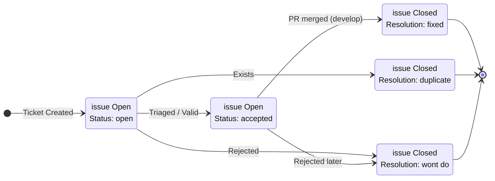

# Contributing to AeroDash

Thank you for your interest in contributing to AeroDash!

As a General Aviation flight-preparation tool, our highest priority is **Safety-First**. We value correctness over speed. A single unverified change in a "Mass & Balance" algorithm could lead to incorrect takeoff data. Therefore, we enforce strict rules to prevent architectural drift, ensure code integrity, and maintain complete traceability.

## Development Direction

To understand where the project is heading, check the roadmap:
👉 [docs/development/roadmap.md](docs/development/roadmap.md)

## 🌟 Welcome & Quick Start

First of all: **Don't panic!** The rules below might look strict, but they are here to guide you, not to scare you away. We love new contributors and are always happy to help you navigate your first Pull Request.

If you are new here, the best way to get started is:

1. **Read the Code of Conduct:** All participation is governed by our [Bilingual Code of Conduct / Verhaltenskodex (Just Culture)](CODE_OF_CONDUCT.md). Please read it first!
2. **Find a "good first issue":** Check the GitHub Project Board for specific `Feature` or `Bug` tickets.
3. **Ask Questions:** If you're unsure about the architecture, where to put a file, or how to write an ADR—just ask in the issue or draft PR! Our senior developers will gladly mentor you.
4. **Draft Early:** You don't have to be perfect from the start. Open a Draft PR early, run the local checks, and we will review and guide you to the finish line.

The rest of this document outlines the formal "Safety-First" rules we follow to keep our flight-preparation tool reliable.

## 📋 Before You Start

* **Read the Requirements:** [docs/requirements/README.md](docs/requirements/README.md)
* **Understand the Branching Strategy:** [docs/development/BRANCHING_STRATEGY.md](docs/development/BRANCHING_STRATEGY.md)
* **Review the Testing Guidelines:** [docs/development/TESTING.md](docs/development/TESTING.md)

## 💻 Environment Setup

* **Tech Stack:** Vue 3 (Composition API, SFCs — no JSX), strict TypeScript, Vite, Pinia, Zod
* **Dependencies:** Node.js (`>=22.12.0` — the devcontainer ships Node 24 LTS)
* **Package Manager:** pnpm (managed via corepack — run `corepack enable pnpm` once)
* **Local Dev Server:** `pnpm --filter frontend dev`
* **Production Build:** `pnpm --filter frontend build`
* **Type-Check:** `pnpm --filter frontend type-check`
* **IDE/Editor:** Visual Studio Code with the recommended workspace extensions (`.vscode/extensions.json`)
* **Optional Vite flags:** copy `frontend/.env.example` to `frontend/.env.local` (Vite reads `.env*` files from `frontend/`, the directory holding `vite.config.ts` — a `.env.local` at the repo root is ignored). `VITE_LOG_DEBUG=true` surfaces `logger.debug(...)` output and `VITE_LOG_TELEMETRY=true` enables `logger.telemetryTrace(...)` — both are OFF by default *everywhere*, including local dev and the unit/integration test runners (issue #263 / DP-004 / CS-012). The dev-time silence is deliberate: `logger.debug()` is an opt-in triage channel, not a "you'll see this on `pnpm dev`" channel, so a `debug` call added during investigation does not silently bit-rot into a permanent unredacted-payload sink. Accepted truthy values: `true`, `1`, `yes`, `on`. **Never enable `VITE_LOG_TELEMETRY` for a production deployment** — it bypasses the PII redactor by design. `frontend/vite.config.ts` aborts `pnpm build` if `VITE_LOG_TELEMETRY` is truthy in any of the `.env*` files Vite will load for the build (it calls `loadEnv()` explicitly, not bare `process.env`), so an accidental production bundle with telemetry cannot ship.

To ensure all quality gates (linting, commit standards) are active, please set up your local environment:

1. **Prerequisites:** Ensure [Node.js](https://nodejs.org/) (v24 LTS) is installed and enable pnpm via Corepack: `corepack enable pnpm`
2. **Install Dependencies:** Run `pnpm install`. This will:
    * Install the required tooling (`markdownlint`, `commitlint`).
    * Automatically activate the **Husky** git hooks.
3. **Verify:** After installation, your commits will be automatically linted.

## 1. 🛡️ Safety-First Philosophy

* **Proof of Correctness:** Every PR affecting the Safety Core (P1) must mathematically or logically prove its correctness.
* **Traceability:** If you write code, we must know *why*. Code changes must trace back to a specific requirement, issue, or Architectural Decision Record (ADR).
* **Isolation:** Code dealing with UI elements (P3) or external weather API calls (P2) must NEVER contaminate the core flight safety calculations (P1).

## 2. 🔀 Branching Strategy

We strictly adhere to the Gitflow model.

* **Never commit directly to `main` or `develop`.**
* Use `feature/...` branches for new code and bug fixes.
* Always open a **Pull Request** targeting the `develop` branch.
* For complete details on our branching model, naming conventions, and protection rules, read our **[Branching Strategy Guide](docs/development/BRANCHING_STRATEGY.md)**.

## 3. 📝 Commit Standards

We enforce **Conventional Commits** (`type(scope): description`) for all changes.
For traceability, you must reference the requirement or issue ID if applicable.

**Allowed Types:**

* `feat`: A new feature
* `fix`: A bug fix
* `docs`: Documentation only changes
* `style`: Code style/formatting (no logic change)
* `refactor`: Code change that neither fixes a bug nor adds a feature
* `test`: Adding missing tests or correcting existing tests
* `chore`: Changes to the build process or auxiliary tools

**AeroDash Specific Scopes:**
The following are the allowed scopes for commits, derived from the project modules. For the complete list of valid scopes and requirements, refer to the **[Requirements Documentation](docs/requirements/README.md)**.

* `ac`: Aircraft Management
* `ap`: Airport Database
* `ad`: Detailed Aircraft Data
* `fe`: Fuel & Endurance
* `mb`: Mass & Balance
* `pf`: Performance
* `wx`: Weather & Meteorological Data
* `ui`: User Interface
* `uq`: Usability & Quality
* `sys`: General System Requirements
* `doc`: Documentation & Export
* `sc`: Cloud Sync & Collaboration
* `repo`: Repository Management, CI/CD, & Meta Tooling

*Example of a valid commit:*
`feat(mb): implement lateral CG calculation bounds (refs #42, REQ-MB-005)`

## 4. ✅ Quality Gates

We use a multi-layered approach to catch issues as early as possible.

### Local (Pre-commit / Pre-push)

Before you can push your branch, your code must pass local quality gates. You should set up your environment to run these automatically.

* **Linting & Typing:** We use specific linting tools depending on the module. For documentation, we strictly enforce rules using `markdownlint-cli2`.
  * To run the markdown linter locally for the entire repository, use: `pnpm exec markdownlint-cli2 "**/*.md" "#.tools" "#.logs" "#node_modules"`
* **Formatting:** All code must be strictly formatted according to project standards.

### CI (Automated Suites)

When you open a PR, GitHub Actions will run comprehensive checks.

* **Automated Tests:** All unit and integration tests must pass.
* **Dependency Isolation:** The CI strictly verifies that architectural boundaries are maintained.
* **Traceability Gate:** PRs targeting `main` trigger the **Traceability Gate** (`.github/workflows/traceability.yml`).
  It checks for orphaned implementations, pending requirements, unmitigated hazards, unverified P1 requirements, and registry drift using `shtracer` (`.tools/shtracer/`).
  Before v1.0.0 the gate is **warn-only** (always exits 0); from v1.0.0 it hard-fails on any gap.
  For details and local commands, see [docs/testing/TESTING.md § CI Traceability Gate](docs/testing/TESTING.md).

### Release (Merge-to-Main)

Merging code to the production `main` branch is highly restricted.

* **No Failing Tests:** Zero tolerance for failing tests or bypassed checks.
* **Mandatory Peer Review:** All code must be reviewed and approved by at least one other developer. Code modifying P1 logic requires approval from a Lead Developer. *Note: Branch protection rules are currently configured to allow administrative overrides to facilitate progress until a secondary reviewer is onboarded.*

#### Markdown Linting

We enforce strict formatting for our documentation to ensure readability and traceability. Before committing Markdown files (`docs/**/*.md`, `README.md`, etc.), you should run the local linter to catch formatting errors.

To run the linter and see errors:

```bash
pnpm exec markdownlint-cli2 "**/*.md"
```

To automatically fix most spacing and structural errors:

```bash
pnpm exec markdownlint-cli2 --fix "**/*.md"
```

## 5. 🧪 Testing Standards

Comprehensive testing is required for all code changes. For detailed information on our testing practices, expectations, and test suite organization, please refer to our **[Testing Standards](docs/testing/TESTING.md)**.

### 5.1 Trace authoring CLI

AeroDash ships its own traceability authoring CLI under `frontend/scripts/trace/`. The CLI is the **only supported way to author and maintain trace tags + registries** — manual edits to `trace/*.yaml` are discouraged and flagged by `trace check`. `shtracer` is retained as the visualisation back-end only.

Run any command from the repo root via `pnpm trace …`.

| Command | Purpose |
| :------ | :------ |
| `pnpm trace parse` | Dump the full scanned tag graph as JSON to stdout (useful for `jq` queries). |
| `pnpm trace check` | Validate invariants (orphans, duplicates, dangling FROM, registry drift). Exits non-zero on violations; pass `--warn-only` to downgrade. |
| `pnpm trace:check:structural` (or `pnpm lint`) | **Hard-fail gate** for the three structural checks — duplicate-tag, dangling-FROM, registry-drift. Diffs against `frontend/scripts/trace/baseline-structural.json` so pre-existing tech debt is grandfathered and only NEW regressions fail. Mirrored by the `repo structural traceability gate` vitest spec so CI enforces it via `pnpm test:unit`. See issue #265. |
| `pnpm trace tag <TYPE> --file <path> [--from REQ-...,DES-...] [--line N]` | Compute the next sequential id, write the comment into the file. Module/layer/phase are inferred from `<path>` — pass explicit segments only when inference cannot decide. |
| `pnpm trace resolve <files...>` | Walk a list of files, replace every `@TYPE@` placeholder with the next generated id. |
| `pnpm trace sync` | Dry-run the registry regeneration (reports planned add/remove/file-mismatch diffs). |
| `pnpm trace sync --apply` | Persist the regenerated `trace/*.yaml` files. The CLI preserves curated titles and `status: deleted` tombstones (STC §5.2). |

> **Structural gate ratchet.** When you legitimately resolve a baselined
> entry (or genuinely cannot avoid a NEW one that is part of a coordinated
> migration), regenerate the baseline with
> `node frontend/scripts/trace/scripts/regen-baseline.mjs` and commit the
> updated `baseline-structural.json` in the same PR. Adding to the
> baseline without a written explanation in the PR description is a
> review red flag — the baseline only shrinks unless something
> exceptional happens.
>
> **No `@E2E-…@` tags in TypeScript comments.** The trace scanner only
> reads `@E2E-…@` from `*.feature` files; the same comment in a `.ts`
> step-definition silently breaks the REQ → UJ → E2E chain. The
> `aerodash/no-e2e-tag-in-ts` ESLint rule fails fast — keep E2E tags in
> the Gherkin layer.

#### Authoring workflows

**Placeholder workflow** — quickest when you're already in the editor:

```ts
// Write a placeholder where the tag belongs:
// @IMP@ (FROM: @REQ-MB-001@)
export function computeZeroFuelMass() { /* … */ }
```

Then run `pnpm trace resolve frontend/src/core/logic/mass-balance.logic.ts` and the placeholder turns into `@IMP-MB-CORE-001@` automatically.

**Explicit tag insertion** — when scripting or fixing legacy code:

```bash
pnpm trace tag IMP \
  --file frontend/src/core/logic/mass-balance.logic.ts \
  --from REQ-MB-001,DES-ARCH-002 \
  --line 7
```

The CLI infers `MB-CORE` from the path and chooses the next free integer.

**Technical E2E** (no UJ trace):

```bash
pnpm trace tag E2E \
  --file frontend/tests/e2e/features/phase-d-system-pwa/smoke.feature \
  --technical \
  --line 1
```

#### Path inference cheat sheet

| Path segment | Inferred module | Inferred layer |
| :----------- | :-------------- | :-------------- |
| `modules/mass-balance/` | `MB` | (from sub-folder, e.g. `views/` → `VIEW`) |
| `modules/performance/` | `PF` | — |
| `core/` | (parent module folder) | `CORE` |
| `stores/` | (parent module folder) | `STORE` |
| `router/` | — | `ROUTE` |
| `plugins/` | — | `PLUGIN` |
| `shared/` | — | `SHARED` |

For phases, the leaf segment of `frontend/tests/e2e/features/phase-X-*/...` is matched against `A`-`G`/`STRESS`.

When inference fails (e.g. `frontend/src/main.ts`), the CLI exits with a clear `Cannot infer module from path …` message — supply the missing segments via positional arguments (`pnpm trace tag IMP SYS APP --file …`).

#### File extensions in scope

| Tag type | Extensions scanned | Comment styles recognised |
| :------- | :----------------- | :------------------------ |
| `IMP` | `.ts`, `.vue` (excludes `*.spec.ts`, `*.int.spec.ts`, `*.e2e.spec.ts`) | `// @IMP-…@` (script blocks), `<!-- @IMP-…@ -->` (Vue `<template>` blocks) |
| `UT` | `.spec.ts` (excludes `*.int.spec.ts`, `*.e2e.spec.ts`) | `// @UT-…@` |
| `IT` | `.int.spec.ts` | `// @IT-…@` |
| `E2E` | `.feature` | `# @E2E-…@` |
| `REQ`, `UJ`, `DES`, `H` | `.md` (Markdown) | `<!-- @…@ -->` |

`pnpm trace sync --apply` will preserve any registry entry whose `files:` list points only to out-of-scope extensions (e.g. a `.json` fixture) or whose id doesn't match the type's canonical regex — these are scanner blind spots, not stale entries. The defensive behaviour is reported in the sync summary as `preserved=N` with one `~ <id>` line per entry.

## 6. 📖 Pull Request Standards

A "Good PR" is small, focused, and easy to review.

* **Review your own code first!**
* You **must** use our `.github/pull_request_template.md` and check all applicable boxes, specifically the Safety Considerations and Traceability sections.
* If your changes affect Requirements, Architecture, or Risk Mitigation, you must update the corresponding `docs/` files in the same PR.
* **Traceability Tags:** You must include traceability inline code tags (e.g., `// @IMP-SYS-001@ (FROM: @REQ-SYS-001@)`) inside your new source files linking your implementation to the upstream Master Traceability Matrix requirements. Use the local **trace CLI** to generate the next free id and insert the comment — never hand-write the integer suffix. See [§ 5.1 Trace authoring CLI](#51-trace-authoring-cli) below.
* **Journey Coverage:** If your PR adds or modifies a P1 requirement, verify that the requirement is tagged in at least one UJ in `docs/journeys/`. If not, extend an existing journey or propose a new one. Check with: `grep -r "@REQ-XX-YYY@" docs/journeys/`
* **Changelog:** Add your changes under `## [Unreleased]` in `CHANGELOG.md`. Use `### Added`, `### Changed`, `### Fixed`, or `### Engineering` (for non-user-facing work). Entries are moved to the release version during the release branch.

## 7. 🏗️ P1 Constraints (The Safety Core)

The components residing in the Safety Core (P1) are governed by stricter rules:

* **Detailed Reviews:** Changes here will undergo extreme scrutiny.
* **ADR Requirement:** If you are changing the fundamental way a P1 module operates, or altering the developer workflow, you **must** draft a new Architectural Decision Record (ADR) or update an existing one. See our **[Documentation as Code / ADR Guide](docs/architecture/adr/README.md)** for instructions on how to write an ADR.
* **No "Quick Hacks":** Workarounds are not acceptable in P1. If a library doesn't behave, fix the library or find a different, verifiable approach.

### Autonomous AI Contributions

An optional overnight automation can implement triaged `accepted` + `engineering`
issues and open **Draft** PRs (see
[ADR-317-DEV](docs/architecture/adr/317-DEV-autonomous-ai-contribution.md) and the
[operator guide](docs/development/autonomous-implementation.md)). It is an aid to,
**never a replacement for**, human review:

* Every machine-authored PR is a **Draft** and is **never auto-merged**.
* Any P1 (`frontend/src/core/`) or `safety-critical` change still requires human
  **Lead Developer** approval — the automated reviewer cannot satisfy that gate.
* All quality gates run unchanged; the automation never uses `--no-verify`.
* **Opt an issue out** of automation by adding the **`automation:opt-out`** label;
  the nightly kill switch is the repo variable `AUTOMATION_ENABLED`.

## 8. 🏷️ P1/P2/P3 Dependency Classification Guide

AeroDash enforces a strict unidirectional dependency flow. Every piece of source
code must be classified before it is written. Misclassification is the root cause
of "illegal dependency" ESLint errors. See **[ADR 314](docs/architecture/adr/314-DEV-dependency-isolation.md)** for the full decision record.

### Classification Rules

| Tier | Directory | May import from | Must NOT import from | Examples |
| :--- | :-------- | :-------------- | :------------------- | :------- |
| **P1** | `src/core/` | `node:*`, `zod`, other `src/core/` files | `vue`, `pinia`, `vue-router`, `src/modules/`, `src/shared/`, `src/stores/`, `src/plugins/`, `src/router/` | Math engines, Zod schemas, domain types |
| **P2** | `src/modules/` | P1 + `vue`, `pinia`, other `src/modules/` | `src/shared/`, `src/stores/` global state (read via Pinia **only**) | Feature stores, composables, services |
| **P3** | `src/shared/`, `src/stores/`, `src/plugins/`, `src/router/` | P1 + P2 + `vue`, `pinia`, `vue-router` | — | Base components, layouts, global stores, plugins |

**Decision rule for new code:** Ask *"Can a defect here produce an incorrect
Go/No-Go advisory?"* If yes → P1. If it modifies data that feeds P1 → P2.
Otherwise → P3.

### How P1 Communicates Outward (Dependency Inversion)

P1 functions are **pure**: they accept validated input and return typed results
(`MathCoreResult`, `Violation[]`, etc.). They never call back into P2/P3. Upper
layers consume the return values and translate them into notifications or UI
state. If P1 must declare a contract that P3 implements (e.g. a notification
type), the *interface/type is defined in `src/core/domain/`* and P3 imports it
— never the reverse.

### Fixing an "Illegal Dependency" ESLint Error

1. Identify the import that triggered the `[P1-ISOLATION]` error.
2. Determine why P1 needs that symbol.
3. **Preferred:** Move the symbol definition into `src/core/domain/` as a pure
   TypeScript type or interface, then re-import from there.
4. **If the dependency is a utility function:** Rewrite it as a pure function
   with no framework references and place it in `src/core/logic/` or
   `src/core/adapters/`.
5. **If the need cannot be satisfied without a framework:** The design is
   incorrect — the logic does not belong in `src/core/`. Reclassify it to P2 and
   expose only the result type back to P1.
6. Never add an `// eslint-disable` comment to suppress a `[P1-ISOLATION]`
   error. This is treated as a critical defect in P1 PRs.

### Third-Party Library Governance

* **P1-allowed libraries:** TypeScript standard library (`lib.es*`), `zod`.
  No other runtime dependencies may appear in `src/core/`.
* **P2/P3 libraries** (e.g. `chart.js`, `vue-chartjs`) must not be imported
  from `src/core/` under any circumstances.
* When evaluating a new library, record in the PR description which tier it is
  allocated to.

### Mandatory P1 PR Review Checklist

Every Pull Request touching `src/core/` must have a reviewer verify:

* [ ] No `vue`, `pinia`, or `vue-router` import in the modified files.
* [ ] `pnpm --filter frontend test:p1` passes (Node.js environment, zero P2/P3 deps).
* [ ] `pnpm --filter frontend run lint:ci:eslint` passes with no `[P1-ISOLATION]` warnings.
* [ ] All new exported functions are pure (deterministic, side-effect free).
* [ ] All external inputs are validated with Zod before reaching math logic.
* [ ] 100 % line + branch + function coverage on new P1 code
  (`pnpm --filter frontend coverage:unit --config vitest.config.p1.ts`).
* [ ] If a new top-level `src/` directory was added, the `no-restricted-imports`
  pattern list in `frontend/eslint.config.ts` has been updated accordingly.
* [ ] An ADR exists or has been updated if the P1 interface surface changed.

### Running P1 Tests in Isolation

```bash
# Run only P1 core tests (no jsdom, no Vue, no Pinia)
pnpm --filter frontend test:p1

# Run with coverage
pnpm --filter frontend vitest run --config vitest.config.p1.ts --coverage
```

## 9. 🐛 Issue Creation (Bugs & Features)

Non-code contributions are highly valued! If you find a bug or have an idea, please open an issue using one of our templates (`.github/ISSUE_TEMPLATE/`).

* **Be Thorough:** In aviation software, details matter. Provide complete reproduction steps for bugs, or detailed problem statements and context for new features.
* **Safety Impact:** Both bug and feature templates ask about "Potential Safety Impact." Please consider this carefully. Could your bug lead to an incorrect data display? Could the new feature confuse a pilot?
* **Definition of Done:** For feature requests, providing a clear "Checklist" or "Definition of Done" allows developers to understand exactly when the feature is considered complete and safe to merge.

## 10. 🗂️ Project Board & Ticket System

We use the GitHub Project Board (`AeroDash Dashboard`) to track all tasks and ensure transparent status management. For the formal architectural decision defining these rules, consult the **[Ticket Workflow ADR](docs/architecture/adr/303-DEV-ticket-workflow.md)**.

### Issue Types

* **`Bug`**: A flaw, error, or failure in the system.
* **`Feature`**: A request for new functionality or enhancements. Note that this is **not limited strictly to runtime product features!** It also applies to enhancements in project infrastructure, such as adding Documentation as Code (`docs`), defining new Requirements, or creating Contributing Guidelines.
* **`Task` — ⛔ DISCONTINUED.** The `Task` / sub-task type and parent/child sub-issues are no longer used: **do not create new `Task` issues or sub-issue links** (the template is gone and a newly-applied `Task` label is auto-stripped by the `Issue Labels` workflow). Split large work into **independent `Feature`/`Bug` issues** instead. Existing `Task` issues are still implemented and closed normally; once all are closed the type will be removed entirely (tracked by #341).

### Scope Labels

* **`product`**: The issue relates to user-facing product functionality. Changes go into `### Added` / `### Changed` / `### Fixed` in the CHANGELOG.
* **`engineering`**: The issue relates to the development environment, tooling, CI/CD, or documentation. Changes go into `### Engineering` in the CHANGELOG.

### Safety Tags

* **`safety-critical`**: Flags an issue that directly impacts the P1 Safety Core, requiring extreme scrutiny and ADR traceability.

### Workflow Statuses & Lifecycle

The following diagram shows how **issue labels** transition through the lifecycle. Labels above the line (`open`, `accepted`) are **status labels** tracking active work. Labels below (`fixed`, `duplicate`, `wont_do`) are **resolution labels** applied when closing an issue.



**Status Labels** (active work):

* **`open`**: Ticket created. This is the initial default label of any new ticket.
* **`accepted`**: The ticket is reviewed, recognized as valid, and moved to *Waiting for Implementation* on the board.

**Resolution Labels** (applied when closing):

* **`fixed`**: The PR implementing the ticket was merged to `develop`. The issue is closed and moved to *Done*.
* **`duplicate`**: The ticket already exists. You must link the duplicate issue before closing.
* **`wont do`**: The ticket is valid but will not be implemented. The rationale must be documented.

### Kanban Board

| Board Column | Meaning |
| :--- | :--- |
| Backlog | Created, awaiting triage |
| Waiting for Implementation | Triaged, valid, prioritised |
| In Progress | Actively being worked on |
| In Verification | PR open, under review |
| Done | PR merged to `develop`, issue closed |

### ⚠️ Special Rules: Parent Tickets vs. Sub-Tasks (⛔ LEGACY — being phased out)

> **Sub-tasks are discontinued.** No new `Task` issues or parent/child sub-issues are
> created (see *Issue Types* above). The rules in this section apply **only to the
> `Task` issues that already exist**, so they can be implemented and closed correctly.
> Once every existing `Task` is closed, this whole section — and the type — is removed (tracked by #341).

* A **`Task`** acts as a sub-task to a parent **`Feature`** or **`Bug`**.
* **Sub-tasks (`Task`)**: Are closed with `fixed` and moved to *Done* as soon as their PR is merged into `develop`, a `release/`, or a `hotfix/` branch.
* **Parent Tickets (`Feature` / `Bug`)**: Can **only** be labelled `fixed`, closed, and moved to *Done* when **all** of its sub-tasks are closed. *(Note: A sub-task closed as `wont do` counts as closed, provided the rationale is documented in the ticket).*
* **A feature is "finished" only when every child is finished.** Implement a parent feature one of two ways — never partially:
    1. **All-in-one:** implement the feature *and* **all** its sub-tasks on the same branch; that single PR to `develop` carries `Closes #<feature>` plus `Closes #<each-sub-task>`.
    2. **Incremental:** implement the sub-tasks first (each its own branch + PR, `Closes #<sub-task>`); the **last** sub-task's PR — opened once every sibling is already closed — *also* carries `Closes #<feature>`, closing the parent in the same merge.
  Never close a feature while any sub-task is still open, and never leave a feature open once its last sub-task is done.
* **Discovery / scoping tickets are the exception to the umbrella rule.** A ticket whose deliverable is an *evaluation or recommendation* — it says so ("discovery / scoping ticket", "not an implementation ticket", "produce a recommendation", "file follow-up issues") — is **finished once its recommendation is written and its follow-ups are filed**. Close it then with `Closes #`; do **not** hold it open as an umbrella. The follow-ups it spawns are **independent** issues that merely *reference* it (e.g. "Spawned by #N") — they are **not** native sub-issues and must **not** block its closure.
* Tickets labelled `duplicate` or `wont do` are removed from the project board entirely.

### Closing requires a complete, ticked attestation

A ticket is closed (`fixed`) only when its **Definition of Done is genuinely met and attested** — and attestation means **every checkbox is ticked `[x]`**, in **both** the issue *and* the closing PR:

* Tick `[x]` an item you have genuinely completed and verified.
* If an item does **not apply** to this change, still tick it `[x]`, mark it `N/A`, and give a one-line reason. An unticked `[ ]` reads as an open obligation — even when truly N/A.
* **Never** tick an item that applies but is not done — that is a false attestation. Finish it, or split the residue into a follow-up **`Feature`/`Bug`** issue.

The **DoD Attestation Gate** (`.github/workflows/dod-gate.yml`) enforces this on the issue side — a PR that closes an issue with any unticked DoD box fails the check — and the PR template's checklist enforces it on the PR side (see `/pr.create`).
