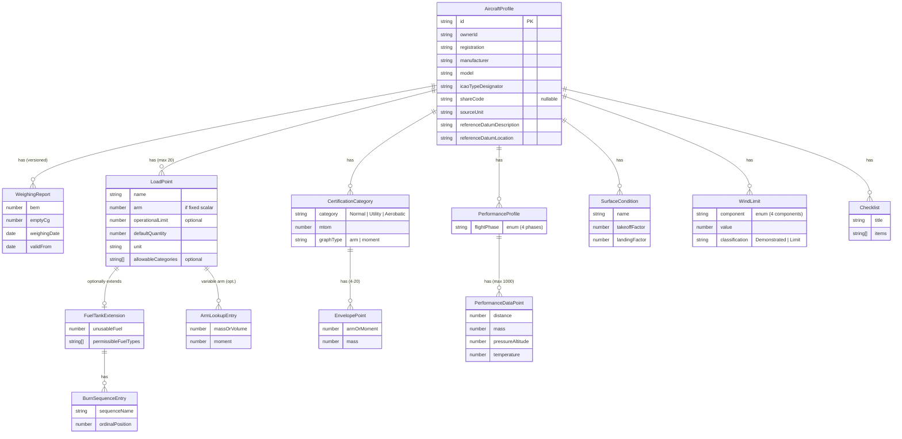

# AeroDash Architecture - Aircraft Data Model

<!-- @ARCH-002@ (FROM: @REQ-AD-001@, @REQ-AD-002@, @REQ-AD-003@, @REQ-AD-004@, @REQ-AD-005@, @REQ-AD-006@, @REQ-AD-007@, @REQ-AD-008@, @REQ-AD-009@, @REQ-AD-010@, @REQ-AD-011@, @REQ-AD-012@, @REQ-AD-013@, @REQ-AD-014@, @REQ-AD-015@, @REQ-AD-016@, @REQ-AD-017@, @REQ-AD-018@, @REQ-AD-019@) -->

**Version:** 1.0
**Date:** 2026-03-05
**Status:** Approved
**ADR:** [003-aircraft-data-model](adr/003-aircraft-data-model.md)

## 1. Overview

This document defines the **Aircraft Profile** data model — the aggregate-root document that represents a single aircraft configuration within AeroDash. It is the central data structure consumed by the Safety Core (Mass & Balance, Performance, Fuel & Endurance), stored in IndexedDB, and exported/imported as JSON.

The model is designed as a **single document aggregate** optimized for:

- Single-key IndexedDB lookups (offline-first)
- Zod schema validation in `core/validation/`
- Direct JSON serialization for export/import (REQ-SC-007, REQ-SC-008)
- Cloud sync as an atomic unit

## 2. Entity Relationship Diagram

## 3. Entity Definitions

### 3.1 AircraftProfile (Root)

The top-level aggregate root. One IndexedDB record = one `AircraftProfile`.

| Field                       | Type                      | Required | Description                                       | Source Requirement |
| :-------------------------- | :------------------------ | :------: | :------------------------------------------------ | :----------------- |
| `id`                        | `string`                  |   Yes    | Unique profile identifier (UUID v4).              | —                  |
| `ownerId`                   | `string`                  |   Yes    | Identifier of the owning user.                    | REQ-AD-019         |
| `registration`              | `string`                  |   Yes    | Aircraft registration (e.g., `D-EBPF`).           | REQ-AD-001         |
| `manufacturer`              | `string`                  |   Yes    | Aircraft manufacturer.                            | REQ-AD-001         |
| `model`                     | `string`                  |   Yes    | Aircraft model designation.                       | REQ-AD-001         |
| `icaoTypeDesignator`        | `string`                  |   Yes    | ICAO type designator code.                        | REQ-AD-001         |
| `sourceUnit`                | `string`                  |   Yes    | Original unit system from manufacturer's POH/AFM. | REQ-AD-014         |
| `referenceDatumDescription` | `string`                  |   Yes    | Textual description of the reference datum.       | REQ-AD-007         |
| `referenceDatumLocation`    | `string`                  |   Yes    | Physical location of the reference datum.         | REQ-AD-007         |
| `shareCode`                 | `string \| null`          |    No    | Share-code for ad-hoc profile sharing.            | REQ-AD-018         |
| `operatingCost`             | `OperatingCost`           |    No    | See Section 3.8.                                  | REQ-AD-006         |
| `weighingReports`           | `WeighingReport[]`        |   Yes    | See Section 3.2. At least one entry required.     | REQ-AD-004, AD-013 |
| `loadPoints`                | `LoadPoint[]`             |   Yes    | See Section 3.3. Max 20.                          | REQ-AD-002         |
| `certificationCategories`   | `CertificationCategory[]` |   Yes    | See Section 3.5. At least one entry required.     | REQ-AD-011         |
| `performanceProfiles`       | `PerformanceProfile[]`    |   Yes    | See Section 3.6.                                  | REQ-AD-008         |
| `surfaceConditions`         | `SurfaceCondition[]`      |   Yes    | See Section 3.7.                                  | REQ-AD-015         |
| `safetyFactors`             | `SafetyFactors`           |    No    | See Section 3.7.                                  | REQ-AD-016         |
| `windLimits`                | `WindLimit[]`             |    No    | See Section 3.9.                                  | REQ-AD-017         |
| `checklists`                | `Checklist[]`             |    No    | See Section 3.10.                                 | REQ-AD-010         |

### 3.2 WeighingReport

Stored as an array on `AircraftProfile` to support versioning via the `validFrom` date.

| Field          | Type     | Required | Description                                | Source Requirement |
| :------------- | :------- | :------: | :----------------------------------------- | :----------------- |
| `bem`          | `number` |   Yes    | Basic Empty Mass.                          | REQ-AD-004         |
| `emptyCg`      | `number` |   Yes    | CG position at empty mass.                 | REQ-AD-004         |
| `weighingDate` | `string` |   Yes    | Date of the weighing report (ISO 8601).    | REQ-AD-004         |
| `validFrom`    | `string` |   Yes    | Effective date for this record (ISO 8601). | REQ-AD-013         |

### 3.3 LoadPoint

Generic loading station (seats, baggage compartments, tanks). Up to 20 per profile.

| Field                 | Type                        | Required | Description                                                                                                                                    | Source Requirement |
| :-------------------- | :-------------------------- | :------: | :--------------------------------------------------------------------------------------------------------------------------------------------- | :----------------- |
| `name`                | `string`                    |   Yes    | Human-readable station name.                                                                                                                   | REQ-AD-002         |
| `arm`                 | `number \| null`            |  Cond.   | Fixed scalar lever arm. Required if `armLookup` is null.                                                                                       | REQ-AD-002, AD-012 |
| `armLookup`           | `ArmLookupEntry[] \| null`  |  Cond.   | Variable arm table. Required if `arm` is null.                                                                                                 | REQ-AD-012         |
| `operationalLimit`    | `number \| null`            |    No    | Maximum capacity for this station.                                                                                                             | REQ-AD-002         |
| `defaultQuantity`     | `number`                    |   Yes    | Pre-filled default value.                                                                                                                      | REQ-AD-002         |
| `unit`                | `string`                    |   Yes    | Measurement unit (stored in source unit).                                                                                                      | REQ-AD-002, AD-014 |
| `allowableCategories` | `string[] \| null`          |    No    | Certification categories in which this load point is available (e.g., `["Normal"]`). If `null`, the load point is available in all categories. | REQ-AD-002         |
| `fuelTank`            | `FuelTankExtension \| null` |    No    | Fuel-specific extension. See Section 3.4.                                                                                                      | REQ-AD-003         |

#### 3.3.1 ArmLookupEntry

Used when the arm/moment relationship is non-linear (e.g., swept-wing fuel tanks).

| Field          | Type     | Required | Description                        | Source Requirement |
| :------------- | :------- | :------: | :--------------------------------- | :----------------- |
| `massOrVolume` | `number` |   Yes    | Input value (mass or volume).      | REQ-AD-012         |
| `moment`       | `number` |   Yes    | Corresponding moment at that load. | REQ-AD-012         |

### 3.4 FuelTankExtension

Optional extension applied to a `LoadPoint` to specialise it as a fuel tank. Up to 10 load points may carry this extension.

| Field                  | Type                  | Required | Description                                                                     | Source Requirement |
| :--------------------- | :-------------------- | :------: | :------------------------------------------------------------------------------ | :----------------- |
| `unusableFuel`         | `number`              |   Yes    | Unusable fuel quantity.                                                         | REQ-AD-003         |
| `permissibleFuelTypes` | `string[]`            |   Yes    | Allowed fuel types (`MoGas`, `AvGas 100LL`, `Jet A-1`, `AvGas UL91`, `Diesel`). | REQ-AD-003         |
| `burnSequences`        | `BurnSequenceEntry[]` |   Yes    | One or more named burn sequences with ordinal position for this tank.           | REQ-AD-003         |

#### 3.4.1 BurnSequenceEntry

Defines the ordinal position of a tank within a named burn sequence.

| Field             | Type     | Required | Description                                             | Source Requirement |
| :---------------- | :------- | :------: | :------------------------------------------------------ | :----------------- |
| `sequenceName`    | `string` |   Yes    | Name of the sequence (e.g., `Standard`, `Alternative`). | REQ-AD-003         |
| `ordinalPosition` | `number` |   Yes    | Position in the sequence (1-based).                     | REQ-AD-003         |

### 3.5 CertificationCategory

Each category defines its own Mass & Balance limits. At least one category required per profile. Load point availability per category is determined by each load point's `allowableCategories` field (Section 3.3).

| Field       | Type              | Required | Description                                 | Source Requirement |
| :---------- | :---------------- | :------: | :------------------------------------------ | :----------------- |
| `category`  | `string`          |   Yes    | Enum: `Normal`, `Utility`, `Aerobatic`.     | REQ-AD-011         |
| `mtom`      | `number`          |   Yes    | Maximum Takeoff Mass for this category.     | REQ-AD-011         |
| `graphType` | `string`          |   Yes    | Enum: `arm`, `moment`.                      | REQ-AD-005         |
| `envelope`  | `EnvelopePoint[]` |   Yes    | CG envelope polygon (min 4, max 20 points). | REQ-AD-005, AD-011 |

#### 3.5.1 EnvelopePoint

A single vertex of the CG envelope polygon.

| Field         | Type     | Required | Description                                             | Source Requirement |
| :------------ | :------- | :------: | :------------------------------------------------------ | :----------------- |
| `armOrMoment` | `number` |   Yes    | Arm or moment value (determined by parent `graphType`). | REQ-AD-005         |
| `mass`        | `number` |   Yes    | Mass value at this vertex.                              | REQ-AD-005         |

### 3.6 PerformanceProfile

Container for performance data of a specific flight phase.

| Field         | Type                     | Required | Description                                                                       | Source Requirement |
| :------------ | :----------------------- | :------: | :-------------------------------------------------------------------------------- | :----------------- |
| `flightPhase` | `string`                 |   Yes    | Enum: `TakeoffRoll`, `TakeoffDistance50ft`, `LandingRoll`, `LandingDistance50ft`. | REQ-AD-008         |
| `dataPoints`  | `PerformanceDataPoint[]` |   Yes    | Max 1000 entries.                                                                 | REQ-AD-009         |

#### 3.6.1 PerformanceDataPoint

A single interpolation point for performance calculations.

| Field              | Type     | Required | Description                   | Source Requirement |
| :----------------- | :------- | :------: | :---------------------------- | :----------------- |
| `distance`         | `number` |   Yes    | Result value (distance).      | REQ-AD-009         |
| `mass`             | `number` |   Yes    | Condition: aircraft mass.     | REQ-AD-009         |
| `pressureAltitude` | `number` |   Yes    | Condition: pressure altitude. | REQ-AD-009         |
| `temperature`      | `number` |   Yes    | Condition: temperature.       | REQ-AD-009         |

### 3.7 SurfaceCondition & SafetyFactors

#### SurfaceCondition

| Field           | Type     | Required | Description                                         | Source Requirement |
| :-------------- | :------- | :------: | :-------------------------------------------------- | :----------------- |
| `name`          | `string` |   Yes    | Surface type name (e.g., `Dry Grass`, `Wet Grass`). | REQ-AD-015         |
| `takeoffFactor` | `number` |   Yes    | Correction factor for takeoff distance.             | REQ-AD-015         |
| `landingFactor` | `number` |   Yes    | Correction factor for landing distance.             | REQ-AD-015         |

#### SafetyFactors

| Field     | Type     | Required | Description                                     | Source Requirement |
| :-------- | :------- | :------: | :---------------------------------------------- | :----------------- |
| `takeoff` | `number` |   Yes    | POH-mandated minimum safety factor for takeoff. | REQ-AD-016         |
| `landing` | `number` |   Yes    | POH-mandated minimum safety factor for landing. | REQ-AD-016         |

### 3.8 OperatingCost

| Field              | Type      | Required | Description                                | Source Requirement |
| :----------------- | :-------- | :------: | :----------------------------------------- | :----------------- |
| `costPerHour`      | `number`  |   Yes    | Operating cost per flight hour.            | REQ-AD-006         |
| `fuelCostIncluded` | `boolean` |   Yes    | Whether fuel cost is included in the rate. | REQ-AD-006         |

### 3.9 WindLimit

Per-component wind limitation with classification.

| Field            | Type     | Required | Description                                                     | Source Requirement |
| :--------------- | :------- | :------: | :-------------------------------------------------------------- | :----------------- |
| `component`      | `string` |   Yes    | Enum: `MaxCrosswind`, `MaxTailwind`, `MaxTotalWind`, `MaxGust`. | REQ-AD-017         |
| `value`          | `number` |   Yes    | Limit value.                                                    | REQ-AD-017         |
| `classification` | `string` |   Yes    | Enum: `Demonstrated`, `Limit`.                                  | REQ-AD-017         |

### 3.10 Checklist

| Field   | Type       | Required | Description                      | Source Requirement |
| :------ | :--------- | :------: | :------------------------------- | :----------------- |
| `title` | `string`   |   Yes    | Checklist title.                 | REQ-AD-010         |
| `items` | `string[]` |   Yes    | Ordered list of checklist items. | REQ-AD-010         |

## 4. Requirement Traceability Matrix

| Requirement | Title                      | Mapped Entity / Field(s)                                                  |
| :---------- | :------------------------- | :------------------------------------------------------------------------ |
| REQ-AD-001  | Basic Aircraft Attributes  | `AircraftProfile.{registration, manufacturer, model, icaoTypeDesignator}` |
| REQ-AD-002  | Load Point Configuration   | `LoadPoint.*` (incl. `allowableCategories`)                               |
| REQ-AD-003  | Fuel Tank Configuration    | `FuelTankExtension.*`, `BurnSequenceEntry.*`                              |
| REQ-AD-004  | Weighing Report Data       | `WeighingReport.{bem, emptyCg, weighingDate}`                             |
| REQ-AD-005  | Flight Envelope Definition | `CertificationCategory.{graphType, envelope}`, `EnvelopePoint.*`          |
| REQ-AD-006  | Operating Cost Tracking    | `OperatingCost.*`                                                         |
| REQ-AD-007  | Reference Datum Storage    | `AircraftProfile.{referenceDatumDescription, referenceDatumLocation}`     |
| REQ-AD-008  | Performance Profile Def.   | `PerformanceProfile.flightPhase`                                          |
| REQ-AD-009  | Performance Data Points    | `PerformanceDataPoint.*`                                                  |
| REQ-AD-010  | Checklist Storage          | `Checklist.*`                                                             |
| REQ-AD-011  | Certification Categories   | `CertificationCategory.{category, mtom, envelope}`                        |
| REQ-AD-012  | Variable Loading Stations  | `LoadPoint.{arm, armLookup}`, `ArmLookupEntry.*`                          |
| REQ-AD-013  | Weighing Report Versioning | `WeighingReport.validFrom`, `AircraftProfile.weighingReports[]`           |
| REQ-AD-014  | Original Unit Preservation | `AircraftProfile.sourceUnit`                                              |
| REQ-AD-015  | Surface Condition Factors  | `SurfaceCondition.*`                                                      |
| REQ-AD-016  | Operational Safety Factors | `SafetyFactors.*`                                                         |
| REQ-AD-017  | Wind Limit Storage         | `WindLimit.*`                                                             |
| REQ-AD-018  | Share-Code Storage         | `AircraftProfile.shareCode`                                               |
| REQ-AD-019  | Owner Identifier Storage   | `AircraftProfile.ownerId`                                                 |

## 5. Implementation Notes

1. **Zod Schema:** The authoritative runtime schema will be defined as a Zod object in `src/core/validation/`. Field constraints (array lengths, enum values, min/max points) shall mirror the limits stated in this document and the source requirements.
2. **IndexedDB Storage:** Each `AircraftProfile` is stored as a single JSON document keyed by `id`. The `ownerId` + `registration` pair shall have a compound index to support the uniqueness check required by REQ-AC-003.
3. **Unit Handling:** All numeric values within a profile are stored in the manufacturer's original unit (REQ-AD-014). The Safety Core's unit normalization layer (`src/core/units/`) converts to SI at calculation time — never at storage time.
4. **JSON Export/Import:** The document structure is designed so that `JSON.stringify` / `JSON.parse` of an `AircraftProfile` produces a valid exchange file (REQ-SC-007, REQ-SC-008).
