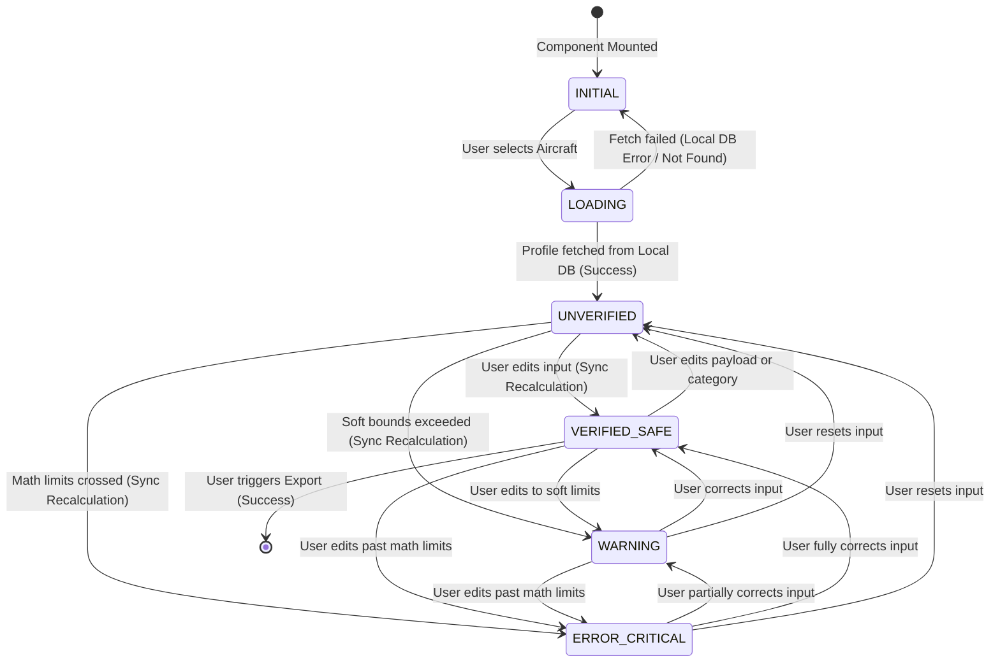

# Frontend Reactivity: State Machine

This document defines the strict state machine governing Vue component reactivity, specifically designed to prevent implicit state transitions, race conditions, and to explicitly bound test execution.

This state machine controls the taxonomy mapped into the UI layer (see `docs/ux/design_system.md`).

## 1. Global UI State Diagram

The following Mermaid diagram outlines the explicit allowed state transitions. Components must strictly enforce these transitions using explicit Pinia store actions, rejecting implicit `v-model` mutations that might bypass validation boundaries.

## 2. State Definitions

### 2.1 INITIAL

- **Condition:** No context loaded. The tool is empty.
- **Reactivity Bound:** All calculation inputs (Weights, Volumes) are `disabled`. The Math Core is asleep.
- **Transitions out:** `LOAD_PROFILE` action dispatched.

### 2.2 LOADING

- **Condition:** Pending asynchronous IndexedDB/Local fetch for aircraft profile geometry. _Note: This is an offline-first app (`REQ-SYS-001`), so this fetch is local, not over the internet._
- **Reactivity Bound:** Input states intentionally "locked." Prevent duplicate clicks/race conditions during `await`.
- **Transitions out:** Promise resolved (`UNVERIFIED`) or Promise rejected/timeout (`INITIAL` - e.g., corrupted local DB).

### 2.3 UNVERIFIED

- **Condition:** Aircraft profile loaded. The user has _not_ verified the mandatory fields (e.g. they just opened an old configuration and must review it, or they are starting from standard empty weights).
- **Reactivity Bound:** Inputs are enabled. Math core actively calculates in the background, but the Export/Save actions are gated.
- **Transitions out:** User edits data triggering recalculation and Notification schema capture (`VERIFIED_SAFE`, `WARNING`, or `ERROR_CRITICAL`).

### 2.4 VERIFIED_SAFE (Success)

- **Condition:** All inputs dirty/confirmed, math core returns zero Warnings or Errors. Safety constraints (MTOM, MZFM, Point-in-Polygon) are met.
- **Reactivity Bound:** Export Action unlocked. Chart visuals bound to `color: success`.

### 2.5 WARNING (Soft Violation)

- **Condition:** Math core computes correctly, but inputs are outside standard operational ranges (e.g. Passenger > 120kg `[WARN-UI-001]`).
- **Reactivity Bound:** Form submission allowed. Visuals bound to `color: warning`. Math logic execution continues.

### 2.6 ERROR_CRITICAL (Hard Violation)

- **Condition:** Math core throws a Critical Notification (`CRIT-MB-001`). Aerodynamic or structural safety has failed.
- **Reactivity Bound:** Export Action locked (`disabled=true`). Chart and banner visuals forcibly bound to `color: error`.

---

## 3. Implementation Directives (Vue)

To ensure this state machine cannot be bypassed:

1. **Unidirectional Flow:** Vue components shall not edit the calculation store directly via two-way `v-model`.
2. **Synchronous Real-Time Execution (`REQ-MB-001`, `002`, `003`, `REQ-UI-009`):** When a component dispatches an action (e.g. `updateStationWeight`, `changeCategory`), the store must pause state evaluation, run the `core/math` algorithms synchronously, catch the Notification Schema result, and **then** update the formal State Machine pointer in a single reactive tick to ensure real-time chart updates without visual tearing.
3. **Deterministic Testing:** Tests must specifically target hitting each state boundary and transition matrix path defined in the flowchart.

---

## 4. Error-Recovery Strategies

The state machine must account for systemic failures outside of standard operational warnings.

### 4.1 Corrupted Local Database (`LOADING --> INITIAL`)

- **Failure:** The IndexedDB fetch for the aircraft profile fails or returns malformed schema data.
- **Recovery:** The state reverts to `INITIAL`. The system displays a Local Data Error notification and provides a UI action to "Restore Default Profiles" (wiping and reseeding the local database from bundled JSON).

### 4.2 Unhandled Math Exceptions

- **Failure:** The `core/math` algorithms throw an unhandled exception (e.g., `NaN` proliferation due to a corrupted data pointer).
- **Recovery:** The component utilizes Vue's `onErrorCaptured` lifecycle hook (or a global ErrorBoundary wrapper). The error is swallowed, the specific module state is forcefully purged back to `INITIAL`, and a CRITICAL alert prompts the user to re-select the aircraft.

### 4.3 Safe Reset

- **Failure:** The user becomes "lost" in a complex error state (e.g., heavily overloaded and unable to trace which bag caused the CG shift).
- **Recovery:** The UI must always expose a "Clear Payload / Reset to Empty" action that instantly transitions the store from `ERROR_CRITICAL` back to `UNVERIFIED` (with empty station weights).
